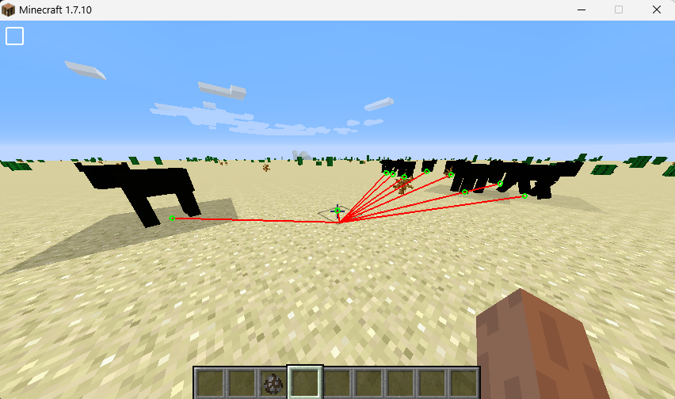

# wglSwapBuffers Hook

Demo in Minecraft Forge 1.7.10 with an Entity ESP using JNI

## Overview
A minimalist ESP hack for Minecraft Forge 1.7.10 that highlights entities through walls. This project uses wglSwapBuffers hooking to render ESP overlays directly on the game's rendering pipeline.

The hook is byte patching: 
detour -> trampoline -> original func

## Usage
1. Inject the DLL into Minecraft process (javaw.exe)
2. Up key to enable ESP

This is a rework of a project I created a long time ago. It demonstrates basic OpenGL hooking techniques for game overlays.